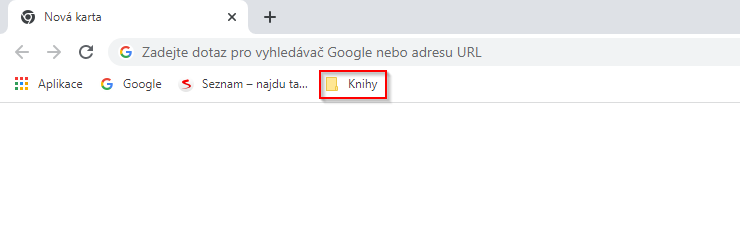
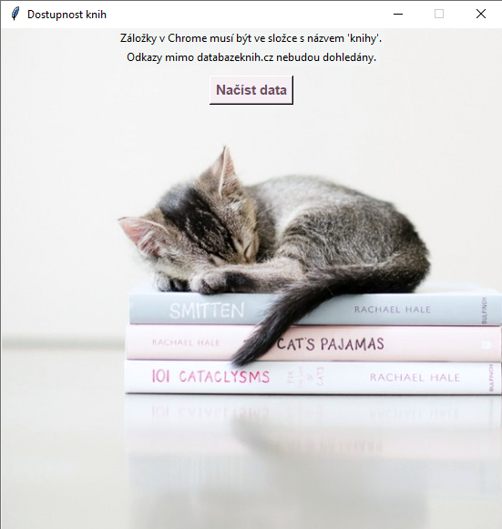
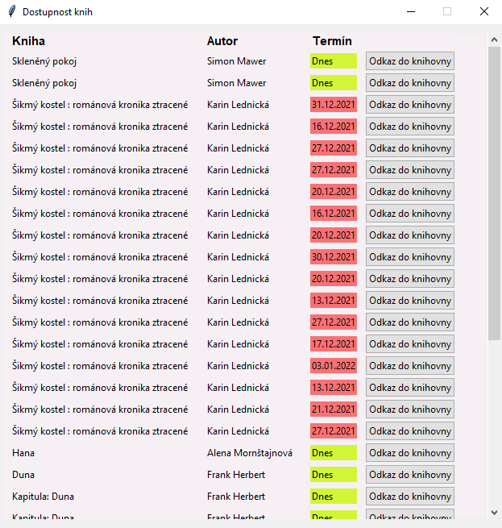

# BooksAvailability
Python program with GUI for searching for books availability in the library (Krajská knihovna Vysočiny). Programs has these key files:
1) kkVysociny.py - the main program which performs all steps
2) config.py - contains a program configuration (ie paths, folders name etc.)
3) chrome_classes - contains classes for getting urls from chrome bookmarks, searching data on databazeknih.cz website and on library's catalog
4) chrome_gui - contains tkinter classes for graphical user interface

First you need to have a folder in bookmarks bar in Chrome. Name of the folder is optional but you have to change it in config.py. Then you add some book urls from website databazeknih.cz. Books from these url will be search on kkVysociny.cz and check their availability.

If you run a program kkVysociny.py a graphical user interface will initiate. You can see the button with label ("Načíst data" = "Load data") and when you press it program will execute in these steps:
1) Check your internet connection - if you are offline, an alert window will pop up and next steps wont be executed
2) Load urls from Chrome bookmarks folder and check if they contain website databazeknih.cz (other urls wont be searched)
3) Scrape the urls and get a books author and a books name (saved as list of dictionaries)
4) Go to library books catalog where you can check if a book is available, then search for books with parameters authors and books names (data from the previous step)
5) Save data from the library catalog as list of dictionaries - dictionary contains: books name with author, books library url, books status (available, not available), terms when book is returned back to library
6) Show data from the previous step via gui (picture below)

 
Data from the last step are shown in tkinter scrollable window. Window is split into 4 columns.
1) Books names
2) Books authors
3) Books availability and dates of returned back to the library (if lent)
      - if a book is available then a labes has green background and text "Dnes" (= "Today")
      - if not available then the background is red and text is a date of return
4) Buttons with action - if a button is pressed then a new tab in a browser is opened and books library url is loaded
